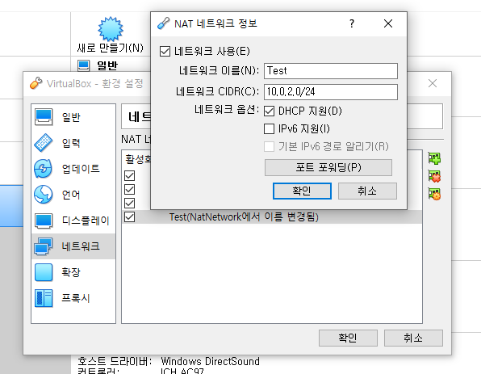
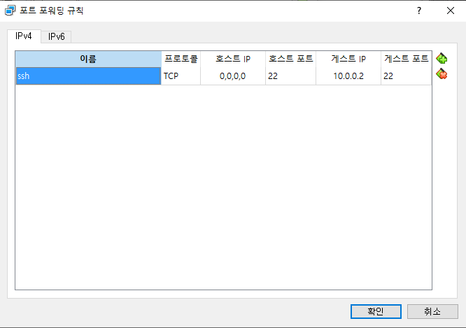

# Ubuntu 셋팅
#### 설치가 끝났으면 우분투 업데이트와 업그레이드를 해야 한다.
```
sudo apt-get update
sudo apt-get upgrade
```
---
#### SSH Server 설치
우분투에 `SSH Server`를 설치 하여 외부에서 접속 가능 하도록 셋팅 하자.
우분투 명령 프롬프트 창에 아래와 같이 입력 한다.
```
sudo apt-get openssh-server
```
---
#### VM 포트 설정
VM(Oracle VM VirtualBox)에 설치 했다면 NAT Network로 설정 해서 포트 포워딩을 해야 한다.
아래 순서대로 따라 하면 된다.

1. 환경 설청 창을 열기 : 파일 -> 환경설정 (Ctrl + G)
2. 네트워크 항목 선택
3. 새 NAT 생성

4. 생성된 NAT 더블 클릭 하여 포트 포워딩 설정

---
